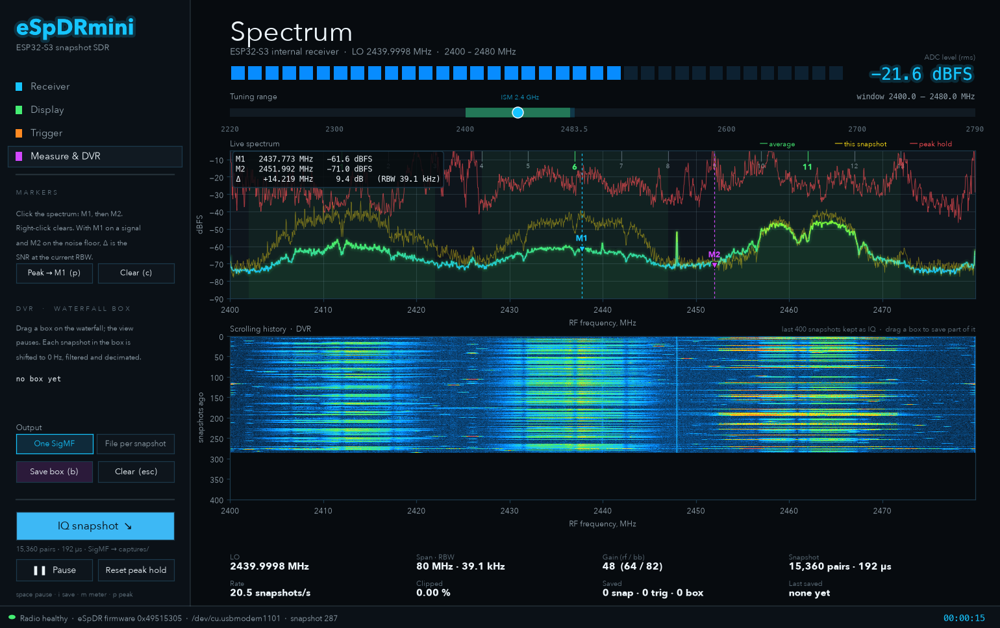
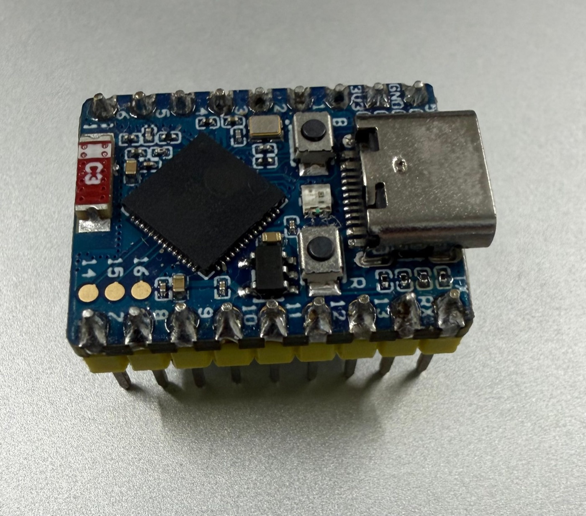

# eSpDRmini

**An 80 MHz-wide spectrum analyser and IQ recorder for 2.2–2.8 GHz, built
from a thumbnail-sized ESP32-S3 board and a USB cable.**

eSpDRmini is a small companion to [**eSpDR**](https://github.com/h0m3us3r/eSpDR)
by [h0m3us3r](https://github.com/h0m3us3r). Everything that makes it possible,
from getting raw IQ out of the ESP32-S3's radio to tuning its PLL and setting
its gain, filters and calibration, comes from eSpDR. This project adds a
"snapshot" mode to eSpDR's firmware, so you can explore the 2.4 GHz band with
nothing but the ESP32-S3 itself, plus a desktop viewer for doing it.

---

## Thank you, eSpDR

Before anything else: **this project would not exist without
[eSpDR](https://github.com/h0m3us3r/eSpDR).**

The ESP32-S3 is sold as a Wi-Fi and Bluetooth chip. Nothing in Espressif's
documentation says its receiver can hand you raw baseband samples, let alone
at 80 million IQ pairs per second. h0m3us3r found the undocumented sample-dump
engine that writes those samples into SRAM. They then built everything around
it:

* bare-metal firmware running on both cores straight from RAM;
* calibration of the receive path, retuning of the RF PLL anywhere from 2.2 to
  2.8 GHz by scanning the VCO capacitor bank, and control of the gain stages,
  baseband filters, DC offset and IQ balance;
* a cycle-exact, SIMD-packed, two-core GPIO link that pushes 200 MB/s of
  samples into an FPGA;
* the FPGA design that compresses the stream losslessly and sends it to a PC
  over USB 3, verified end to end;
* a polished WebGL spectrum and waterfall frontend.

It's an outstanding piece of reverse engineering and systems work, and it's
released under the Zero-Clause BSD license, so anyone can build on it. That
openness is what made this project possible. If eSpDRmini interests you,
**please go and look at [eSpDR](https://github.com/h0m3us3r/eSpDR) and star
it**: the full system is far more capable than this one, with continuous,
gap-free 80 Msps streaming. Its
[radio write-up](https://github.com/h0m3us3r/eSpDR/blob/main/docs/RADIO.md) is
a great read on its own.

eSpDRmini adds about 225 lines to eSpDR's firmware (see
[firmware/espdr-snapshot.patch](firmware/espdr-snapshot.patch)). Everything
clever in it is eSpDR's.

---

## What eSpDRmini is, and isn't

eSpDR proper streams every sample, continuously, through an FPGA. eSpDRmini
leaves the FPGA out. The ESP32-S3 captures one block of **15,360 to 61,440
contiguous IQ samples** (192–768 µs at 80 Msps, 0.96–3.84 ms at 16 Msps),
sends it over its own USB port, and repeats, **5 to 20 times a second**
depending on the block length. That's a series of short, high-bandwidth looks at
the band rather than a continuous stream, which is plenty for:

* watching Wi-Fi, Bluetooth, microwave ovens and other 2.4 GHz activity live;
* measuring signal levels and SNR with markers;
* catching bursts with a trigger and saving them as IQ;
* cutting a band and time window out of the waterfall as filtered IQ for
  offline analysis.

It isn't a continuous recorder: anything that happens between snapshots is
missed. For that, build the full [eSpDR](https://github.com/h0m3us3r/eSpDR).

## Hardware

Developed on an **ESP32-S3 Super Mini**, a widely available board about
22 × 18 mm:

* ESP32-S3FH4R2: dual-core 240 MHz Xtensa LX7, 4 MB flash and 2 MB PSRAM in
  the package, 40 MHz crystal;
* small ceramic chip antenna (the red part, left);
* USB-C wired to the chip's **native USB** (USB Serial/JTAG), BOOT (B) and
  RESET (R) buttons, and an RGB LED.

**Any ESP32-S3 board should work** if its native USB port is wired to the
connector. Look for a port that appears with USB vendor ID `303a`; boards that
only have a USB-to-UART bridge (CP210x or CH340) won't work. Other ESP32
variants (ESP32, S2, C3, C6 and so on) won't work either; the firmware
depends on S3-specific hardware. The antenna matters: a board with a u.FL
connector and a proper 2.4 GHz antenna will hear more than a chip antenna.

Use a USB **data** cable. Charge-only cables are the most common reason the
board doesn't appear.

> **Planning to move up to the full eSpDR?** Its FPGA link needs GPIO 3–7,
> 9–18, 41 and 46. The Super Mini doesn't bring out 17, 18, 41 or 46, so for
> eSpDR proper use a full-size board such as the ESP32-S3-DevKitC-1, as the
> eSpDR README describes.

## Quick start

    git clone https://github.com/kingjamez/eSpDRmini && cd eSpDRmini
    python3 -m venv .venv
    .venv/bin/pip install -r requirements.txt      # Windows: .venv\Scripts\pip
    .venv/bin/python viewer.py                     # Windows: .venv\Scripts\python

The viewer finds the board, loads the firmware into its RAM (about a second)
and starts showing the band around 2440 MHz.

* **Nothing is written to flash.** The firmware runs from RAM. Unplug the board
  and it goes back to whatever it ran before.
* Options: `--lo 2412` (MHz), `--gain 50`, `--rate 16` (Msps), `--port PORT`,
  `--rows 400` (DVR depth), `--show-mac` (see Privacy below).
* **Linux:** if the port isn't accessible, add yourself to the `dialout` (or
  `uucp`) group and log in again.
* **Board not found:** try another cable; or hold **B**/BOOT while plugging
  it in, which forces the ROM bootloader.

Tested on macOS (Apple silicon) with Python 3.14. The serial port lookup and
loader are written for Linux and Windows too, but haven't been tested there
yet; reports are welcome.

## Using the viewer

The left sidebar has four pages. **IQ snapshot**, **Pause** and **Reset peak
hold** stay at the bottom on every page.

**Receiver.** Tune by typing an LO frequency, using the ±5/±20 MHz buttons,
dragging the tuning-range slider across the top (it shows the 2.4 GHz ISM band
and the slice you're viewing), or double-clicking anywhere on the spectrum or
waterfall. The gain selector is eSpDR's gain-table index: about 1 dB per step
from 35 to 76. Gain 40–55 suits a typical indoor 2.4 GHz environment; above
about 70 the ADC clips, and the level meter and "Clipped" figure turn red.
The sample rate is 80 Msps (80 MHz span) or 16 Msps (16 MHz span, finer
detail). **Snapshot length** chooses 1 to 4 capture banks per snapshot:
15,360 to 61,440 contiguous samples, which is 192–768 µs at 80 Msps or
0.96–3.84 ms at 16 Msps. Longer blocks catch more of each burst and give
smoother spectra, at 20, 10, 7 or 5 snapshots per second. The length applies
to everything: the live view, IQ snapshots, triggers and the DVR.

**Display.** Show or hide the level meter (the layout closes up when it's
hidden); a channel overlay for Wi-Fi (channels 1–14, with 1/6/11 highlighted)
or Bluetooth LE (all 40 channels, with advertising channels 37/38/39
highlighted); FFT size 1k–8k, which sets the resolution bandwidth (RBW);
averaging; floor and ceiling levels, which set both the spectrum scale and
the waterfall colours; and whether each waterfall row shows the snapshot's
peak or its average. Settings are remembered.

**Trigger.** Arm it, set a threshold, and drag across the spectrum to choose a
band (the default is the full span). Every snapshot whose strongest bin in
that band crosses the threshold is saved to `captures/triggers/`, with a
hold-off between saves and a maximum number of saves. Each file records what
triggered it.

**Measure & DVR.**
* *Markers:* click the spectrum to place M1, then M2. The readout shows each
  marker's frequency and level and the difference between them. With M1 on a
  signal and M2 on the noise floor, the difference is the signal's SNR at the
  current RBW. `p` puts M1 on the strongest peak; right-click or `c` clears.
* *DVR:* the raw IQ behind the last 400 waterfall rows (about 20 seconds) is
  kept in memory. Drag a box on the waterfall and the view pauses; the box
  sets a frequency range and a span of snapshots. **Save box** writes just
  that: each snapshot shifted to the box centre, filtered to the box width and
  decimated. Choose one SigMF recording or one file per snapshot.

| Key | Action |
|---|---|
| `space` | pause / play |
| `i` | save an IQ snapshot (pause first to save exactly what's on screen) |
| `m` | show or hide the level meter |
| `p` / `c` | M1 to the peak / clear markers |
| `b` / `Esc` | save / clear the DVR box |
| double-click | tune to that frequency |

## How it works

    ┌──────────────── ESP32-S3 (eSpDR firmware + snapshot patch, in RAM) ───────────────┐
    │  antenna → LNA → mixer (RF PLL, LO 2.2–2.8 GHz) → baseband filters → 10-bit ADCs   │
    │       → sample-dump engine ──80 Msps──▶ SRAM capture banks 0–3 (4 × 16,384 words)  │
    │  core 0: on ESP_SNAPSHOT, chain 1–4 banks, check the joins, pack 20 bits/pair,     │
    │          CRC32 ──▶ USB Serial/JTAG (12 Mbit/s)                                     │
    └────────────────────────────────────────────────────────────────────────────────────┘
                                         │  USB
    ┌──────────────────────────────── host (Python) ────────────────────────────────────┐
    │  espctl.py  control protocol, RAM loader, unpacking + CRC check                   │
    │  viewer.py  receiver thread ─▶ spectra ─▶ display · trigger · DVR ring (400 rows)  │
    │  dsp.py     FFTs, box extraction (mix · FIR · decimate), SigMF writer              │
    └────────────────────────────────────────────────────────────────────────────────────┘

### 1. The radio (all eSpDR)

The ESP32-S3's 2.4 GHz receiver downconverts RF to baseband and digitises I
and Q with 10-bit ADCs. eSpDR's firmware calibrates the PHY with Espressif's
own PHY library, then takes direct control. It tunes the RF PLL by
programming a frequency word and scanning the VCO's 512 capacitor codes for
the middle of the longest locking window. It sets the gain stages, baseband
filter, DC offset and IQ correction. It routes the baseband samples to an
undocumented **sample-dump engine** that writes each IQ pair into a 32-bit
SRAM word (I in bits 0–9, Q in bits 10–19) at 80 or 16 million pairs per
second, into a ring of 16,384 words in one of four 64 KiB capture banks.

The receiver's convention is that I + jQ has its spectrum mirrored: a signal
at RF = LO + f appears at −f. The viewer accounts for this, and every saved
file is flipped (conjugated) back to the usual orientation.

### 2. The snapshot patch (eSpDRmini)

eSpDR normally keeps the dump engine running and has both CPU cores bit-bang
completed banks out to the FPGA. The patch adds one command to eSpDR's control
protocol, `ESP_SNAPSHOT` (op 40), whose argument is a number of capture banks
from 1 to 4. On request, core 0:

1. fills each bank it will use with a sentinel value that a 20-bit sample can
   never equal;
2. starts the dump engine in bank 0 at ring index 0 and polls its write
   index. After about 15,700 new pairs it switches the writer to the next
   bank, where the ring index simply carries on, so no samples are lost. This
   is the same bank-chaining eSpDR uses for streaming, without the
   transmission in between;
3. stops the engine after the last bank and waits for samples still in its
   pipeline. It then locates each bank's data exactly from the sentinels
   around it and checks that every bank begins precisely where the previous
   one ended. If any join is off by even one sample, it reports failure
   instead of sending a damaged block;
4. replies, then streams 15,360 pairs per bank (skipping the first 256),
   packed two pairs per five bytes (38,400 bytes per bank instead of 61,440),
   followed by a CRC32.

Bank 3 overlaps the ROM's working memory. Like eSpDR's streaming code, a
4-bank snapshot saves that memory first and restores it after sending.

Joins were checked on real signals as well: a steady carrier was fitted on
either side of every join in many 4-bank captures. The phase change across a
join matched points inside a bank (median about 0.1 rad), whereas a single
lost or repeated sample would show as 0.63 rad. Over 400 four-bank captures
at both sample rates, none failed.

Core 1 stays idle and the GPIO link is never driven. The build also turns off
eSpDR's 20 MHz clock output for the FPGA (`-DNO_FORWARDED_CLOCK`), which
isn't needed here. The image is loaded with `esptool --no-stub load-ram`, the
same way eSpDR's own host tool loads it, and talks over the chip's built-in
USB Serial/JTAG port. That port runs at USB full speed (12 Mbit/s): each bank
adds 38 KB and about 50 ms, which sets the rate at 20 snapshots per second for
1 bank down to 5 for 4.

### 3. The host

* **`espctl.py`** speaks eSpDR's framed control protocol (10-byte requests
  and 16-byte responses, each with a CRC32), loads the firmware, and unpacks
  and verifies snapshots. It's also a small command-line tool:
  `python espctl.py status` or `python espctl.py snap -n 10 --save x.cs16`.
* **`viewer.py`** runs a receiver thread that applies setting changes (a
  dragged slider sends many; only the last is applied, and a retune takes
  about 19 ms) and requests snapshots. The GUI thread turns each snapshot into
  spectra, updates the display, checks the trigger and stores the snapshot in
  the DVR ring buffer (400 snapshots of int16 IQ: about 24 MB at 1 bank, 98 MB at 4).
* **Spectra.** Each snapshot is split into N-point segments (N = FFT size), and
  each segment is windowed with a Blackman window and transformed. The mean
  over segments gives the "average" trace (then smoothed across snapshots);
  the maximum gives the "this snapshot" peak trace and the waterfall row.
  Levels are dBFS: a full-scale tone reads about 0 dBFS. RBW = sample rate ÷ N.
* **DVR box extraction** (`dsp.extract`). For each snapshot in the box: flip
  to the usual orientation, remove DC, mix the box centre down to 0 Hz,
  low-pass filter with a windowed-sinc FIR (cut-off at half the box width),
  and decimate so the output rate is at least 1.25 times the box width. With
  synthetic tones, a signal inside the box passes at its original level, one
  2 MHz past the edge is 20 dB down, and one far outside is 95 dB down.

### 4. Recordings

Everything is saved as [SigMF](https://sigmf.org): a `.sigmf-data` file plus
a `.sigmf-meta` JSON file with the sample rate, centre frequency, UTC time and
the gain settings. inspectrum, GNU Radio, SDR++ and numpy can read them.

| Saved by | Where | Format | Contents |
|---|---|---|---|
| IQ snapshot | `captures/` | `ci16_le` | 15,360–61,440 contiguous pairs, raw ADC counts (−512…511) |
| Trigger | `captures/triggers/` | `ci16_le` | as above, with an annotation giving the band, level and threshold |
| DVR box, one file | `captures/box_…/box.*` | `cf32_le` | one capture segment per snapshot, each with its own timestamp |
| DVR box, per snapshot | `captures/box_…/snapshot_*` | `cf32_le` | one recording per snapshot |

Box recordings are a series of separate segments, each contiguous on its own,
with gaps of 50–200 ms between them (each segment's `core:datetime` says
when). Treat each segment as its own recording, not as one continuous signal.

**Privacy:** by default, the board's MAC address isn't shown on screen or
written to any file. `--show-mac` turns both on.

## Measured on the Super Mini

| | |
|---|---|
| Tuning range (PLL lock) | 2220–2790 MHz (2210 failed to lock; this varies by chip) |
| Span | 80 MHz at 80 Msps, 16 MHz at 16 Msps |
| Snapshot | 1–4 banks of 15,360 pairs: 192–768 µs at 80 Msps, 0.96–3.84 ms at 16 Msps |
| Snapshot rate | 20 / 10 / 6.6 / 5 per second for 1 / 2 / 3 / 4 banks |
| Retune time | about 19 ms |
| Samples | 10-bit I and Q; levels in dBFS, not calibrated power |

The analog response isn't flat across the 80 MHz span, and strong signals
outside the span can alias into it; see eSpDR's
[radio notes](https://github.com/h0m3us3r/eSpDR/blob/main/docs/RADIO.md).

## Repository

| Path | What |
|---|---|
| `viewer.py` | the GUI |
| `dsp.py` | spectra, DVR box extraction, SigMF writing |
| `espctl.py` | control protocol, firmware loader, command-line tool |
| `firmware/espdr-snapshot.bin` | the firmware image the viewer loads |
| `firmware/espdr-snapshot.patch` | the change to eSpDR, with [rebuild steps](firmware/README.md) |
| `tools/gain_sweep.py` | plots the spectrum at several gain settings ([example](docs/gain_sweep_2440MHz.png)) |

To rebuild the firmware you need eSpDR's source and ESP-IDF v5.5.3 or later;
[firmware/README.md](firmware/README.md) has the steps.

## Ideas

* Continuous narrowband streaming: filter and decimate on the ESP32-S3 itself
  (for example one 250 kHz channel) so the stream fits through the 12 Mbit/s
  USB port.
* A sweep mode that stitches the whole 2220–2790 MHz range into one view.
* The full continuous experience: build [eSpDR](https://github.com/h0m3us3r/eSpDR).

## Credits and license

* **[eSpDR](https://github.com/h0m3us3r/eSpDR)** by h0m3us3r: the radio
  discovery, the firmware this is built on, the control protocol, and the
  documentation that made all of this approachable. Thank you.
* The viewer's look is inspired by [TMOG](https://tmog.org).
* eSpDRmini is released under the [Zero-Clause BSD license](LICENSE), the
  same license as eSpDR.
* The firmware image also contains Espressif's PHY library and ESP-IDF sources
  (Apache License 2.0) and Cadence's Xtensa window vectors (MIT); their
  license texts are in [firmware/](firmware/README.md).
